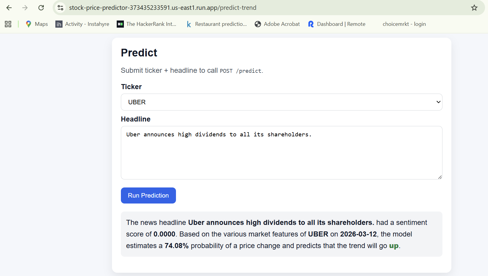

# Market Sentiment & Stock Price Predictor

A **production-ready, modular pipeline** for predicting short-term stock price direction using **market price data and news sentiment.**

The system supports:

- Market price and news sentiment **data ingestion**
- **Data preprocessing** and sentiment analysis
- **Feature engineering**
- **Machine learning model training**
- **On-demand prediction** using ticker + news headline

## Architecture Diagram


## Project Structure

```text
Stock_Price_Prediction/
├── assets/
│   └── architecture-diagram.png       # Project architecture image used in README
├── config/
│   ├── config.yaml                    # Central project configuration values
│   └── configuration.py               # Configuration manager
├── logs/                              # Runtime log files
├── src/
│   └── stock_price_predictor/
│       ├── ingestion/                 # Market/news ingestion modules
│       │   ├── ingestion_pipeline.py
│       │   ├── market_data_ingestion.py
│       │   └── news_ingestion.py
│       ├── warehousing/               # Gold dataset creation + cloud warehouse integration
│       │   ├── data_processing.py
│       │   └── data_storage.py
│       ├── ml_pipeline/               # Training and on-demand prediction modules
│       │   ├── feature_engineering.py
│       │   ├── training_pipeline.py
│       │   ├── model_trainer.py
│       │   └── model_predictor.py
│       ├── entity/                    # Dataclasses for config/pipeline entities
│       ├── utils/                     # Shared utility functions
│       ├── exception.py
│       └── logger.py
├── ui/
│   └── predict.html                   # Browser UI for prediction
├── cloud_functions.py                 # HTTP Cloud Function wrappers
├── tests/
│   ├── conftest.py
│   ├── test_ingestion.py
│   ├── test_warehousing.py
│   └── test_ml_pioeline.py
├── main.py                            # CLI + FastAPI entrypoint
├── Dockerfile
├── Procfile
└── requirements.txt
```

## Quick Start

### Dependency management

Create and activate a virtual environment.

```bash
python -m venv .venv
source .venv/bin/activate
```

Install dependencies:

```bash
pip install -r requirements.txt
```

### Set Google Cloud Credentials in `.env`

```env
GOOGLE_APPLICATION_CREDENTIALS=D:\projects_code\market_prediction\service-account.json
```

### Configure Storage and Warehouse Targets in `config/config.yaml`

- **GCS:** `project.gcs_bucket_name`, `project.gcs_data_dir`, `project.gcs_models_dir`, `project.gcs_logs_dir`
- **BigQuery:** `project.bigquery_project_id`, `project.bigquery_dataset_id`
- **Table IDs:** `data_processing.bigquery_gold_table_id`

### Deploy app in gcp

The application is deployed to **Google Cloud Run** as a Docker container.
Cloud Run builds the container image from the project source and deploys it as a serverless service.

```bash
gcloud run deploy stock-price-predictor --source . --region us-east1 --allow-unauthenticated
```

Currently the app is already running on GCP and its **BASE_APP_URL** is "https://stock-price-predictor-373435233591.us-east1.run.app/"

### Data Ingestion

1. Data ingestion is exposed as an **HTTPs Cloud Function.**

For ingestion of fresh raw data:

```bash
curl -X POST "https://<BASE_APP_URL>/ingest?lookback_days=29"
```

For appending data to existing dataset:

```bash
curl -X POST "https://<BASE_APP_URL>/ingest?append=1"
```

For appending data belonging to new tickers:

```bash
curl -X POST "https://<BASE_APP_URL>/ingest?append=2&tickers=MSFT,AAPL,GOOG,AVGO,UBER"
```

Note:

- Raw files `market_data.csv` and `news_data.csv` are written to GCS.
- `lookback_days` mode refreshes gold in BigQuery.
- `append` mode appends raw in GCS, merges/recomputes gold labels, and rewrites gold in BigQuery.
- `lookback_days` and `append` are mutually exclusive.

### Data Warehousing and Model Training

```bash
curl -X POST "https://<BASE_APP_URL>/train"
```

#### Metrics JSON structure

```json
{
  "train_metrics": {
    "accuracy": 0.916666666666667,
    "precision": 0.911764705882353,
    "recall": 0.911764705882353,
    "f1": 0.911764705882353
  },
  "test_metrics": {
    "accuracy": 0.555555555555556,
    "precision": 0.5,
    "recall": 0.625,
    "f1": 0.555555555555556
  },
  "train_rows": 72,
  "test_rows": 18,
  "feature_count": 30,
  "train_ratio": 0.8
}
```

### On-demand Prediction

#### FastAPI

```bash
curl -X POST "http://127.0.0.1:8000/predict" \
  -H "Content-Type: application/json" \
  -d '{"ticker":"MSFT","headline":"Microsoft beats earnings estimates"}'
```

Note: Prediction requires non-empty `ticker` and `headline`.

**Example:**
Request:

```bash
curl --location 'https://stock-price-predictor-373435233591.us-east1.run.app/predict' \
--header 'Content-Type: application/json' \
--data '{
    "ticker": "GOOG",
    "headline": "Google announces strong quarterly earnings"
}'
```

Response:
````
{
    "ticker": "GOOG",
    "source_date": "2026-03-12",
    "headline": "Google announces strong quarterly earnings",
    "sentiment_score": 0.5106,
    "predicted_target_up": 0,
    "predicted_probability_up": 0.28584971932078895
}
````


#### Web Browser

The prediction feature can be also accessed from:

```
https://<BASE_APP_URL>/predict-trend
```



## Notes

- Replace placeholder APIs in `ingestion/ingestion_pipeline.py` with your data vendors.
- Current sentiment analysis uses VADER for fast baseline modeling.
- Model training currently uses Random Forest; extend with advanced models as needed.
- Runtime logs are mirrored to GCS under `project.gcs_logs_dir`.
