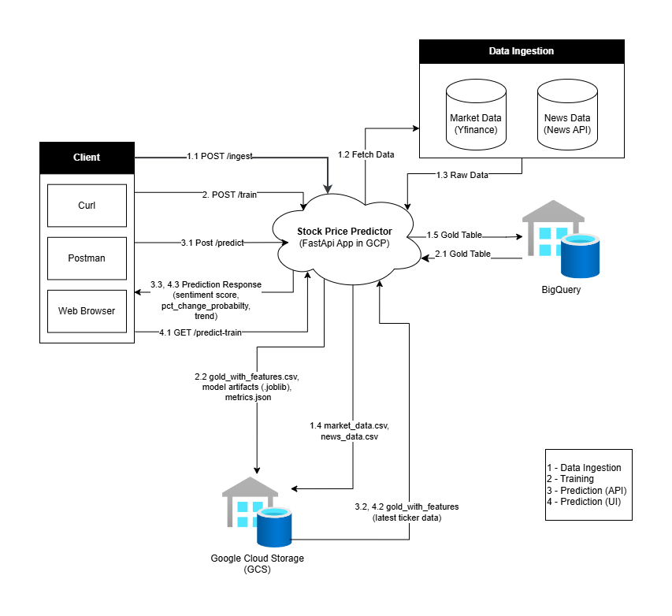

# Market Sentiment & Stock Price Predictor

Production-ready, modular pipeline for:

- Market price + news sentiment data ingestion
- Data preprocessing and sentiment analysis
- Feature engineering
- ML model training
- On-demand prediction from ticker + headline

## Architecture Diagram



## Project Structure

```text
market_prediction/
├── config/
│   ├── config.yaml                    # Central project configuration values
│   └── configuration.py               # Configuration manager
├── notebooks/                         # Experiment notebooks
├── src/
│   └── stock_price_predictor/
│       ├── ingestion/                 # Market/news ingestion modules
│       │   ├── ingestion_pipeline.py
│       │   ├── market_data_ingestion.py
│       │   └── news_ingestion.py
│       ├── warehousing/               # Gold dataset creation + cloud warehouse integration
│       │   ├── data_processing.py
│       │   └── data_storage.py
│       ├── ml_pipeline/               # Training and on-demand prediction modules
│       │   ├── feature_engineering.py
│       │   ├── training_pipeline.py
│       │   ├── model_trainer.py
│       │   └── model_predictor.py
│       ├── entity/                    # Dataclasses for config/pipeline entities
│       ├── utils/                     # Shared utility functions
│       ├── exception.py
│       └── logger.py
├── cloud_functions.py                 # HTTP Cloud Function wrappers
├── tests/
├── main.py                            # CLI + FastAPI entrypoint
└── requirements.txt
```

## Quick Start

### Dependendency management

1. Create and activate a virtual environment.

```bash
python -m venv .venv
source .venv/bin/activate
```

1. Install dependencies:

```bash
pip install -r requirements.txt
```

1. Set BigQuery credentials in `.env`:

```env
GOOGLE_APPLICATION_CREDENTIALS=D:\projects_code\market_prediction\service-account.json
```

1. Configure storage + warehouse targets in `config/config.yaml`:

   - GCS: `project.gcs_bucket_name`, `project.gcs_data_dir`, `project.gcs_models_dir`, `project.gcs_logs_dir`
   - BigQuery: `project.bigquery_project_id`, `project.bigquery_dataset_id`
   - Table IDs: `data_processing.bigquery_gold_table_id`

### Data Ingestion

Data ingestion is exposed as an HTTP Cloud Function.

Cloud Function entrypoint:

```bash
ingest
```

Deploy (Gen2):

```bash
gcloud functions deploy ingest-data \
  --gen2 \
  --runtime python311 \
  --region us-central1 \
  --source . \
  --entry-point ingest \
  --trigger-http \
  --allow-unauthenticated
```

HTTP usage (query params):

```bash
curl -X POST "https://<INGEST_FUNCTION_URL>?lookback_days=29"
```

```bash
curl -X POST "https://<INGEST_FUNCTION_URL>?append=1"
```

```bash
curl -X POST "https://<INGEST_FUNCTION_URL>?append=2&tickers=MSFT,AAPL,GOOG,AVGO,UBER"
```

HTTP usage (JSON body):

```bash
curl -X POST "https://<INGEST_FUNCTION_URL>" \
  -H "Content-Type: application/json" \
  -d '{"lookback_days": 29, "tickers": ["MSFT","AAPL","GOOG","AVGO","UBER"]}'
```

```bash
curl -X POST "https://<INGEST_FUNCTION_URL>" \
  -H "Content-Type: application/json" \
  -d '{"append": 1, "tickers": ["MSFT","AAPL","GOOG","AVGO","UBER"]}'
```

Ingestion behavior:

- Raw files `market_data.csv` and `news_data.csv` are written to GCS.
- `lookback_days` mode refreshes gold in BigQuery.
- `append` mode appends raw in GCS, merges/recomputes gold labels, and rewrites gold in BigQuery.
- `lookback_days` and `append` are mutually exclusive.

### Data Warehousing and Model Training

Cloud Function entrypoint:

```bash
train
```

Deploy (Gen2):

```bash
gcloud functions deploy train-model \
  --gen2 \
  --runtime python311 \
  --region us-central1 \
  --source . \
  --entry-point train \
  --trigger-http \
  --allow-unauthenticated
```

Trigger training:

```bash
curl -X POST "https://<TRAIN_FUNCTION_URL>"
```

Training flow:

- Read Gold from BigQuery (`data_processing.bigquery_gold_table_id`) for the configured lookback window.
- If no Gold rows exist in the window, raise an error.
- Build features dataset in-memory using:
  - `avg_sentiment_headlines` (average sentiment of `headlines_list`)
  - existing feature engineering logic (rolling returns/averages, lags, volume features, etc.)
- Save `gold_with_features_file` as CSV in GCS under `project.gcs_data_dir`.
- Train the model using `train_test_split` with `model_trainer.train_ratio`.
- Run predictions on test split and compute train/test classification metrics.
- Save model `.joblib` and metrics JSON to GCS and log metrics.

Metrics JSON structure:

```json
{
  "train_metrics": {
    "accuracy": 0.0,
    "precision": 0.0,
    "recall": 0.0,
    "f1": 0.0
  },
  "test_metrics": {
    "accuracy": 0.0,
    "precision": 0.0,
    "recall": 0.0,
    "f1": 0.0
  },
  "train_rows": 0,
  "test_rows": 0,
  "feature_count": 0,
  "train_ratio": 0.8
}
```

### On-demand Prediction (FastAPI)

Prediction requires non-empty `ticker` and `headline`.

Flow:

- Load `gold_with_features_file` directly from GCS path `gs://<bucket>/<gcs_data_dir>/<gold_with_features_file>`.
- If missing in GCS or no rows exist for configured lookback window, raise error.
- Validate requested ticker exists in dataset.
- Select latest row (by `date`) for ticker.
- Replace `headlines_list` with input headline and set `avg_sentiment_headlines` from that headline sentiment.
- Run model inference and return prediction.

FastAPI endpoint (if running with uvicorn):

```bash
uvicorn main:app --reload
```

```bash
curl -X POST "http://127.0.0.1:8000/predict" \
  -H "Content-Type: application/json" \
  -d '{"ticker":"MSFT","headline":"Microsoft beats earnings estimates"}'
```

## Notes

- Replace placeholder APIs in `ingestion/ingestion_pipeline.py` with your data vendors.
- Current sentiment analysis uses VADER for fast baseline modeling.
- Model training currently uses Random Forest; extend with advanced models as needed.
- Runtime logs are mirrored to GCS under `project.gcs_logs_dir`.
